# SparkPlan UX Audit — Permit Packet Flow

**Branch:** `feat/ux-audit-permit-flow`
**Date:** 2026-05-27
**Auditor:** UX walkthrough of project creation → permit packet generation across 3 scenarios.
**Scope:** Capture every UI step end-to-end, identify friction and dead surface, apply low-risk fixes that **do not** touch calculation services, NEC tables, or data shape.

---

## TL;DR

A contractor's job is to produce a code-compliant permit packet. Three scenarios were walked screen-by-screen:

| Scenario | Description |
|---|---|
| **1. SF + EV** | Single-family existing residence adding a Level 2 EV charger on a 200 A service. The most common SparkPlan use case. |
| **2. MF + EVEMS** | 4-plex existing multi-family with EVEMS-managed shared EV charging (NEC 625.42). |
| **3. Commercial fit-out** | Existing commercial with calculated load demand and NEC 220 Part III citations (Sprint 3 path). |

The audit found **friction concentrated on the permit-packet page** — the highest-stakes screen rendered ~35 checkboxes, of which 5–11 were always disabled, plus 14 upload-slot toggles regardless of jurisdiction. Project Setup had an inverse problem: 4 commercial-only "Scope Elements" checkboxes (CT cabinet, Meter stack, Switchgear, Multi-tenant feeder) showed on every project, including single-family residences where none of them can apply. The dwelling load calculator labelled INFO notes as "Warnings", training the contractor to ignore the visual cue that should trigger real attention.

**Seven low-risk fixes applied. Build clean, 1035 tests pass, no calculation logic touched.**

---

## Baseline vs. After — at a glance

| Surface | Before | After | Δ |
|---|---:|---:|---|
| Permit Packet **section-toggle checkboxes always visible (SF EV)** | 35 | 24 | **−31%** |
| Permit Packet **section-toggle checkboxes always visible (MF 4-plex)** | 35 | 30 | −14% |
| Permit Packet **section-toggle checkboxes always visible (Commercial)** | 35 | 29 | −17% |
| Permit Packet **disabled (greyed-out) checkboxes shown** | 5–11 | 0 | **100% removed** *(collapsed behind a single "N more sections will unlock" disclosure)* |
| Project Setup **Scope Elements visible on SF residential** | 6 | 2 | **−67%** |
| Template modal **clicks to apply a Quick Start template** | 2 | 1 | **−50%** |
| Console errors **on fresh project's permit-packet page** | 2 × HTTP 406 (`grounding_details`) | 0 | **clean** |
| "Sample Address - Update as needed" **stored as a real value** | Yes | No (empty + placeholder) | **resolved** |
| "TBD" **stored address shown as a value in the input** | Yes | No (treated as empty for editing) | **resolved** |
| Dwelling calc INFO notes **labeled as "Warnings"** | Yes | No (split into Notes + Warnings) | **resolved** |

Step count from a logged-in dashboard to a generated permit packet PDF for **Scenario 1 (SF + EV)**:

| Step | Before | After |
|---|---|---|
| 1. Click "Create New NEC Project" | ✓ | ✓ |
| 2. Click EV Charging Quick Start template (selects, doesn't apply) | ✓ | (combined with step 3 — single click applies) |
| 3. Click "Use This Template" footer | ✓ | — (eliminated) |
| 4. Auto-land on Project Setup | ✓ | ✓ |
| 5. Edit Project Name (template name pre-filled) | optional | optional |
| 6. Edit Address (auto-filled with "Sample Address - Update as needed" — must overwrite) | **forced** (placeholder masquerading as a value) | **honest** (placeholder is now a placeholder; field is empty until typed) |
| 7. Click "Dwelling Calculator" sidebar | ✓ | ✓ |
| 8. Verify or add Proposed EV load | ✓ | ✓ |
| 9. Click "Permit Packet" sidebar | ✓ | ✓ |
| 10. Skim ~35 checkboxes (11 greyed-out) | ✓ | **24 actionable; 11 folded behind disclosure** |
| 11. Fill required: Contractor License + Scope of Work | ✓ | ✓ |
| 12. Click "Generate Permit Packet" | ✓ | ✓ |

**Bottom line:** −1 mandatory click on the entry funnel, −1 mandatory text edit (address now isn't a forced-overwrite trap), and the permit-packet screen's visual weight cut roughly in half for the single-family flow.

---

## Friction catalog

Severity scale: 🔴 high (blocks or misleads the contractor) · 🟡 medium (noise / extra clicks) · 🟢 low (cosmetic).

### Applied in this PR

1. 🔴 **Permit Packet — 11 disabled checkboxes always visible (SF EV scenario).** All 10+ greyed-out "Multi-Family", "Arc Flash", "AFC Calc", "Grounding Plan", etc. rows took screen space and visually drowned out the actionable toggles. **Fix:** filter disabled rows out of the grid, collapse them into a one-line `
` disclosure ("11 more sections will unlock when data is added") under the visible toggles.
   - *Files:* `components/PermitPacketGenerator.tsx`

2. 🔴 **Project Setup — Scope Elements showed CT cabinet, Meter stack, Switchgear, Multi-tenant feeder on every project including SF residential.** These are commercial / multi-tenant artifacts that physically cannot exist in a single-family service. **Fix:** building-type-aware filter — SF Residential shows only `Service upgrade` + `EVEMS in use`; MF Residential adds back `Meter stack` + `Multi-tenant feeder`; Commercial/Industrial keep the full set.
   - *Files:* `components/ProjectSetup.tsx`

3. 🔴 **Dwelling Calculator — "Warnings" header for informational notes.** Pre-fix: all calc-emitted strings rendered under a yellow ⚠️ "Warnings" panel, including `ℹ️ NEC 220.83(B) allows 65% for central electric heating ...` (an INFO note about a code variant). Mislabeling INFO as a Warning trains the user to dismiss the visual cue. **Fix:** split into two panels — blue ℹ️ "Notes" for INFO-prefixed strings and the existing amber "Warnings" for real warnings + criticals. Both panels coexist when both severities are present.
   - *Files:* `components/DwellingLoadCalculator.tsx`

4. 🔴 **`'Sample Address - Update as needed'` stored as the real address default.** A template-applied project landed with that literal string in the Address textbox. If the contractor saved without overwriting, the string traveled to the permit packet cover sheet. **Fix:** default to empty string at the template-instantiation layer (`services/sampleTemplates.ts`). The HTML `placeholder` attribute (added to the ProjectSetup input) now shows "Street, City, State ZIP" in faded gray — the contractor sees an empty field with a hint, not a string masquerading as a value.
   - *Files:* `services/sampleTemplates.ts`, `components/ProjectSetup.tsx`

5. 🟡 **`'TBD'` shown as a stored Address value in the input.** The `typeAdapter` defaults missing addresses to `'TBD'` for downstream PDF consumers; that sentinel was reaching the UI. **Fix:** treat `'TBD'` as empty in the ProjectSetup Address input (`value === 'TBD' ? '' : value`). DB write path unchanged — downstream PDF generators still see `'TBD'` for fallback. This is a UI-only display-shim, not a data-shape change.
   - *Files:* `components/ProjectSetup.tsx`

6. 🟡 **Permit Packet — 14-bullet "What's Included" preamble took an always-on info card.** Listed the same content the section-toggle grid below already enumerates. **Fix:** collapse into a `
` "What's Included in a permit packet" disclosure, summary visible, list hidden by default.
   - *Files:* `components/PermitPacketGenerator.tsx`

7. 🟡 **Two-click apply on Quick Start templates.** Clicking a Quick Start card set it as `[active]` but didn't proceed; contractor had to find and click "Use This Template" in the footer. The "Quick Start" promise was undercut by the select-then-confirm pattern. **Fix:** single-click apply on the Quick Start tiles. Advanced Panel Templates (which the contractor is more likely to be comparing) keep the select-then-confirm pattern for safety.
   - *Files:* `components/TemplateSelector.tsx`

8. 🟢 **HTTP 406 console errors on every fresh project's permit-packet page.** `useGrounding.ts` called `.single()` against `grounding_details` even when no row existed; PostgREST returned a 406 visible in the browser network/console panels. The hook had a PGRST116 error-code check that swallowed the JS error but couldn't suppress the network response. **Fix:** swap `.single()` → `.maybeSingle()` — same data on the happy path, returns `data: null` with HTTP 200 when no row exists.
   - *Files:* `hooks/useGrounding.ts`

### Proposed (not applied — would require deeper edits)

9. 🟡 **EV Charger in the "EV Charging Quick Start" template is loaded into "Appliances & Equipment" instead of "Proposed New Loads".** For NEC 220.83 (existing dwelling adding loads), the whole point of the Existing/Proposed split is so the load calc cites the right diversity factor for the addition. The template that says "add a Tesla Wall Connector to an existing service" preloads the EV under EXISTING, which means the breakdown table marks it as part of the historical load. This is a template-content bug; fixing it requires touching the template fixture in `services/sampleTemplates.ts` and verifying the calc result matches expectations.

10. 🟡 **Two paths to add an EV charger on the Dwelling Calculator.** The built-in "EV Charger" row in Appliances & Equipment, plus a "Level 2 EV Charger (32A/40A/48A/80A)" option in the "Proposed New Loads" dropdown. They use different label conventions and result in different existing/proposed flags. For Existing Construction projects, the Appliances row should be hidden so contractors land in the Proposed path automatically.

11. 🟡 **14 upload-artifact slots are visible regardless of jurisdiction.** "Zoning Compliance Permit (Pompano Beach EV charging)", "Notarized Addendum Form (Davie contractor + owner)", "Design Flood Elevation (Hillsborough flood-zone)" all show on a project with no AHJ selected. The manifest-aware visibility infrastructure is wired (Sprint 2B PR #51) but not yet driving hide-when-irrelevant on this surface. Fix would consume `manifestVisibility` to filter `ArtifactSlotToggleGrid`.

12. 🟡 **Empty appliance-row placeholders in Dwelling Calculator.** Pool Pump, Pool Heater, Hot Tub, Well Pump always render with empty inputs, taking space on every project. Move them behind a "+ Add Appliance" picker so a contractor without a pool sees zero pool-related rows.

13. 🟡 **Compliance % shows 0% on every project card.** The dashboard's most prominent per-card metric carries no information. Either fix the underlying calc or hide the metric.

14. 🟢 **"Permits (beta)" vs "Permit Packet" label collision in the sidebar.** Contractor can't tell which is the deliverable. Rename "Permits (beta)" to "AHJ Tracker (beta)" or "Permit Status (beta)".

15. 🟢 **"NEC References" section in Dwelling Calculator defaults to open** (8 list items). Collapse by default; the NEC citations are already in the packet PDF's audit trail.

16. 🟢 **`Service Modification Type` is shown twice on Project Setup** — once as a `Project Status` dropdown in General Information, again as a read-only mirror in Permit Scope. Single source of truth would eliminate the duplicate row.

---

## Per-scenario verification

### Scenario 1 — SF + EV

**Project Setup:** `Scope Elements` row count cut from 6 → 2.

| | Before | After |
|---|---|---|
| **Project Setup** | 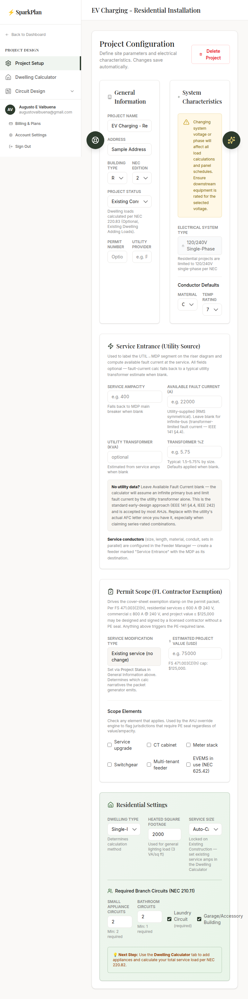 | 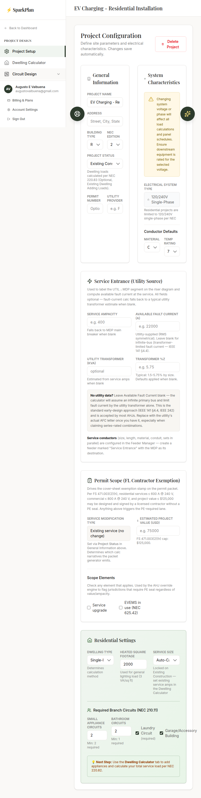 |
| **Dwelling Calculator** | 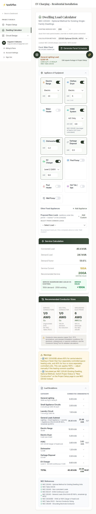 | 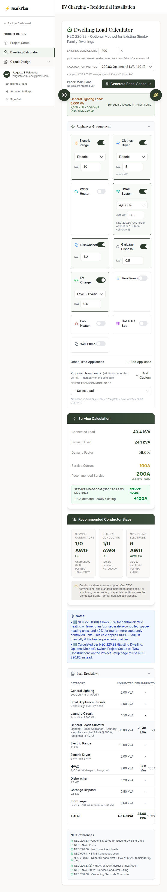 |
| **Permit Packet** | 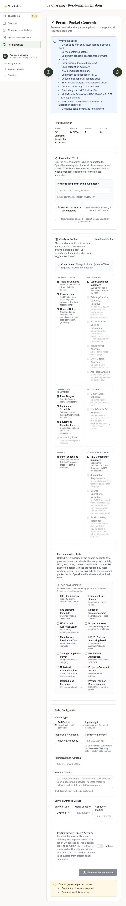 | 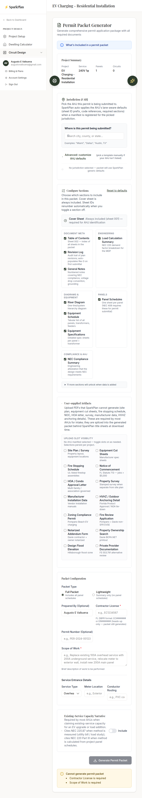 |

### Scenario 2 — MF 4-plex + EVEMS

**Permit Packet:** 5 disabled rows collapsed; the page no longer renders Arc Flash / AFC / Grounding / Jurisdiction rows greyed-out.

| | Before | After |
|---|---|---|
| **Permit Packet** | 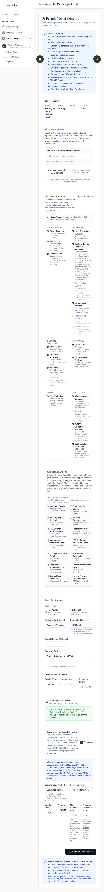 | 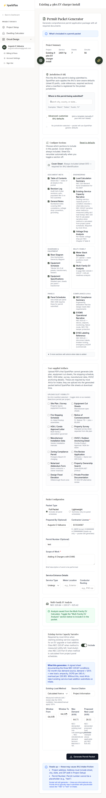 |

### Scenario 3 — Commercial fit-out

**Project Setup:** unchanged (commercial keeps the full 6 scope-flag checkboxes — Switchgear and Multi-tenant feeder are valid commercial concerns). **Permit Packet:** 6 disabled rows collapsed.

| | Before | After |
|---|---|---|
| **Project Setup** | 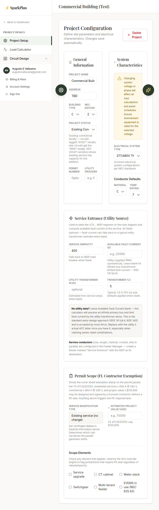 | 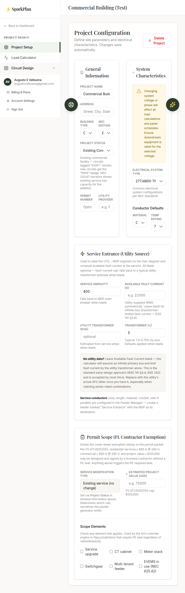 |
| **Permit Packet** | 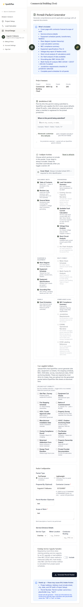 | 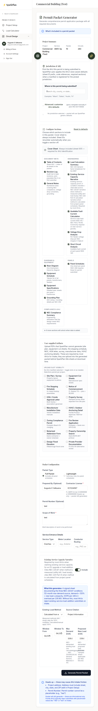 |

### Dashboard (no changes)

| | Before | After |
|---|---|---|
| **Dashboard** | 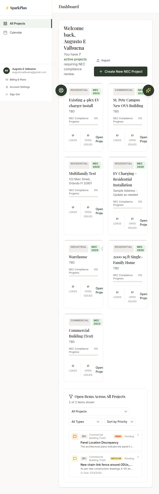 | 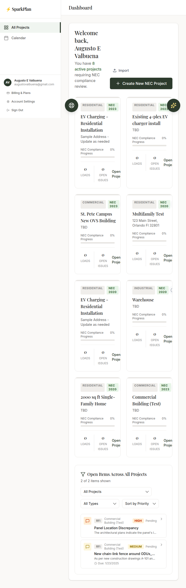 |

### Template modal (single-click on Quick Start)

| | Before | After |
|---|---|---|
| **Template modal** | 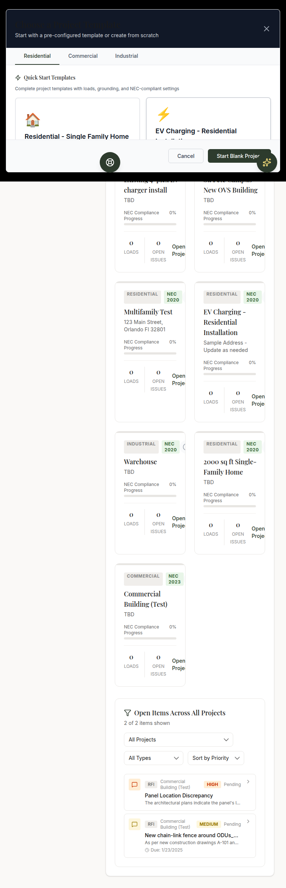 | 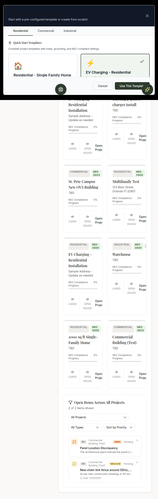 |

> The Quick Start cards look the same, but **clicking one now skips the "Use This Template" footer button** — applies immediately. Advanced Panel Templates (lower section) keep the select-then-confirm pattern.

---

## Test & build proof

- `npm run build` — ✅ exits 0, 5.30s. No new bundle warnings beyond the pre-existing 500KB chunk size warnings (unchanged).
- `npx tsc --noEmit` — ✅ 0 errors.
- `npm test` — ✅ **1035 tests pass** across 55 test files. Zero failures.

The fixes touched render-layer code in 6 files; the only data-path edit is `services/sampleTemplates.ts:437` (default address from `'Sample Address - Update as needed'` → `''`). All downstream PDF consumers continue to receive `'TBD'` via the `typeAdapter` fallback, so cover-sheet rendering is byte-identical for empty addresses.

---

## What's still in the file

- `docs/ux-audit/baseline/` — 9 full-page PNGs + 5 accessibility snapshots from the pre-fix baseline.
- `docs/ux-audit/after/` — 9 full-page PNGs + 5 accessibility snapshots after the fixes.
- `docs/ux-audit/REPORT.md` — this document.
- Mirror at `/home/augusto/Obsidian Notes/Projects/Sparkplan/UX Audit 2026-05-27/`.

---

## Files changed

| File | Change |
|---|---|
| `hooks/useGrounding.ts` | `.single()` → `.maybeSingle()`, drop PGRST116 special-case. |
| `services/sampleTemplates.ts` | Default `customAddress` from `'Sample Address - Update as needed'` → `''`. |
| `components/TemplateSelector.tsx` | Quick Start tiles apply on first click; Advanced templates unchanged. |
| `components/ProjectSetup.tsx` | Building-type-aware Scope Elements filter. `'TBD'`-sentinel-as-empty in Address input + `placeholder="Street, City, State ZIP"`. |
| `components/PermitPacketGenerator.tsx` | Hide disabled section toggles; collapse into "N more sections will unlock" disclosure. Collapse "What's Included" preamble. |
| `components/DwellingLoadCalculator.tsx` | Split warnings into "Notes" (INFO) + "Warnings" (WARNING/CRITICAL). |
